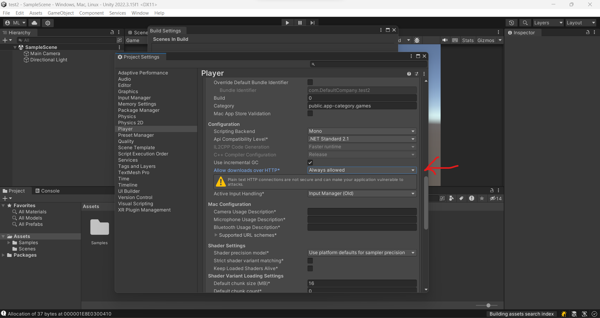
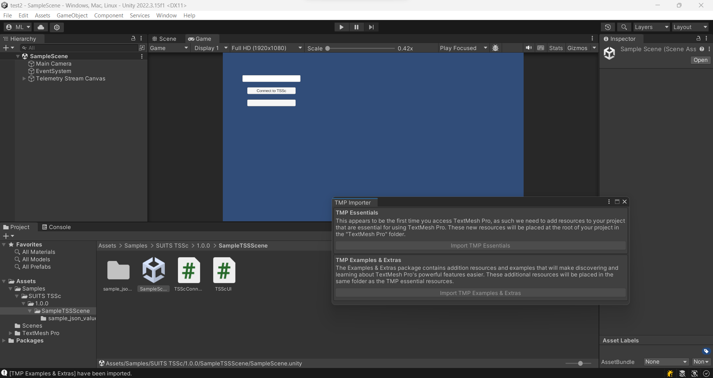
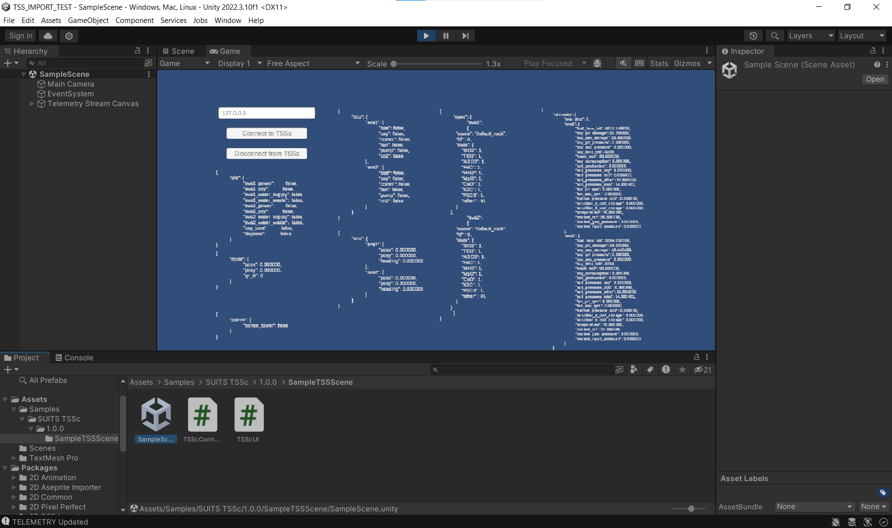

<h1 align="center">
  :man_astronaut: S.U.I.T.S. Unity Package :woman_astronaut:
</h1>
<h4 align="center">
  :telescope: Unity Package to Communicate with the SUITS TSS Server :rocket:
</h4>

---

<h5 align="center">
  <a href="https://microgravityuniversity.jsc.nasa.gov/nasasuits">NASA SUITS Website</a> •
  <a href="#earth_americas-for-suits-teams">For SUITS Teams</a> •
  <a href="#computer-for-nasa-team">For NASA Team</a>
</h5>

---
<br>

## :earth_americas: Setup Unity
1. Download Unity Version 2022.23 or later
2. Create a new Unity Project
3. Clone the repository...\
This repository only contains a single Unity Package File.
```
git clone https://github.com/SUITS-Techteam/TSS_Unity_Package_2024.git
```
4. Add the Unity Package to your project by going to the Assets tab, selecting Import Package, Custom Package, then selecting the Unity package file
5. Enable HTTP downloads by going to the File tab, selecting Build Settings, selecting Player Settings, then under the Player tab select "Always allowed" for Allow downloads over HTTP

7. Expand the Assets folder until you see SampleTSSScene, then double-click the SampleScene file
6. Import TMP Essentials and TMP Examples & Extras 

7. Run the TSS Server (directions at https://github.com/SUITS-Techteam/TSS_2024.git)
8. To run the scene, click the Play button at the top middle of the screen\
You should see something like this...\

9. Modify the IP address to the IP address of the server 
10. Click Connect to TSSc and you should see the data values update
